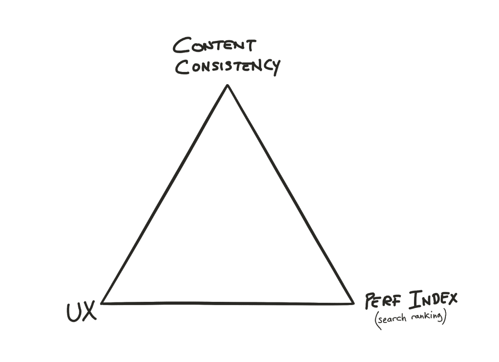

# **January 27, 2020**

Agenda: [https://github.com/ampproject/meta-ac/issues/72](https://github.com/ampproject/meta-ac/issues/72)

Facilitator: [@tobie][tobie]

Scribe:  [@jorydotcom][jorydotcom]

## **Attendees:**

*   Elisa Budelli ([@elibud][elibud])
*   Maggie Wettergreen ([@mjwettergreen][mjwettergreen])
*   Tobie Langel ([@tobie][tobie])
*   Senthil Padmanabhan ([@senthilp][senthilp])
*   Pablo Delgado ([@pdelgadorodriguez][pdelgadorodriguez])

## **Excused:**

*   Joe Alicata ([@wirelessjoe][wirelessjoe])
*   Ted Shuter ([@TedShuter][TedShuter])
*   Kenji Baheux ([@kenjibaheux][kenjibaheux])
*   Ali Ghassemi ([@aghassemi][aghassemi])
*   Charles Vazac ([@cvazac][cvazac])
*   Tim Jones ([@tones][tones])

## **Absent:**

*   David Merrell ([@dymerrell][dymerrell])
*   Guilherme Moser de Souza ([@mobtec][mobtec])
*   Levi Durfee ([@levidurfee][levidurfee])
*   Melanie Sumner ([@melsumner][melsumner])
*   Melissa DePuydt [@msteffan][msteffan])
*   Sumantro Das ([@sumodas][sumodas])
*   Terence Eden ([@edent][edent])
*   Tim Jones ([@tones][tones])

# **Minutes**

**1. Clarifying that meetings are open**

*   Find ways to promote more openness in the meetings
*   If necessary keep a few private minutes at the end of the call.
*   Only record if asked in advance 

**2. Focus 2020 areas:**

*   We weren’t sure if we had quorum to move forward with this.
*   A new concern was brought up that we decided to tackle instead (although it has ties with #64).

**3. UX/Consistency/Perf Index conundrum**

*   Discussion Summary
    *   Tradeoff triangle reported by some constituencies between perf index (search placement), consistency, and UX.
    *   Examples include:
        *   a page with comments becoming too slow in AMP, so the choice becomes either to remove those comments altogether (and lose consistency, which impact their search rating) or use an iframe instead, which is less user friendly.
        *   You get a better perf index embedding youtube in an iframe rather than using the AMP youtube component.
    *   This is perceived as conflicting incentives (do we strive for better UX or better search placement when these two are not aligned; they should be.)
    *   Perception is Google Search is tightening its requirements as AMP is getting more complex (heavier?).
    *   Lack of visibility into perf index for AMP (and thus placement in Search).
    *   Action items
        *   Todo: File an issue with the TSC saying there are reports from AC members of issues with size of the AMP runtime. Is this a known issue? Where is it tracked?
        *   Todo: File an issue about the triangle conundrum and bring it up with the TSC

           

    *   What can we do to address this
        *   How can we work with the TSC to address this

[tobie]: https://github.com/tobie
[wirelessjoe]: https://github.com/wirelessjoe
[cvazac]: https://github.com/cvazac
[mobtec]: https://github.com/mobtec
[levidurfee]: https://github.com/levidurfee
[sumodas]: https://github.com/sumodas
[edent]: https://github.com/edent
[senthilp]: https://github.com/senthilp
[tones]: https://github.com/tones
[kenjibaheux]: https://github.com/kenjibaheux
[elibud]: https://github.com/elibud
[pdelgadorodriguez]: https://github.com/pdelgadorodriguez
[dymerrell]: https://github.com/dymerrell
[jervay]: https://github.com/jervay
[mjwettergreen]: https://github.com/mjwettergreen
[melsumner]: https://github.com/melsumner
[msteffan]: https://github.com/msteffan
[TedShuter]: https://github.com/TedShuter
[grahamle]: https://github.com/grahamle
[LJWatson]: https://github.com/LJWatson
[aghassemi]: https://github.com/aghassemi
[jorydotcom]: https://github.com/jorydotcom